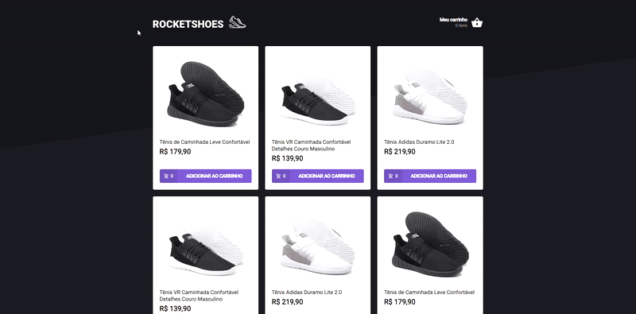

<h1 align="center">
  RocketShoes
</h1>

- - -

<h1>Preview</h1>

  

 

## Tecnologias

Esse projeto foi desenvolvido com as seguintes tecnologias:

- HTML
- STYLED COMPONENTS
- REACT 
- TYPESCRIPT
- FAKE API com JSON Server

## Projeto

 Para rodar esse código em sua máquina, basta usar os comandos: 

 - yarn 
 - yarn server 
 - yarn start

 Esse projeto é um desafio da Rocketseat da trilha de ReactJs, é basicamente um website para vendas de sapatos, onde escolhemos o produto desejado e depois colocamos no carrinho onde é possível alterar a quantidade e ver o valor total, o carrinho está sendo salvo usando o localStorage do navegador com isso salvamos a quantidade e valor dos produtos no carrinho. O foco desse desafio foi criar um hook para o carrinho de compras, e com isso listar a quantidade dos produtos que estão no carrinho, atualizar a quantidade e também removê-los se preciso. Os produtos são rendenrizado em tela que vem da fake API e também é calculado o valor total do carrinho.
- - -

 Template desenvolvido pela Rocketseat como desafio, e criação do hook do carrinho de compras feita por Enan Dorta.